<!-- ═══════════════ HERO — animated ice mountains, wind, snow, butterflies ═══════════════ -->
<div align="center">



<a href="https://git.io/typing-svg">
  
</a>

<br/>


<br/><br/>

<a href="https://arvind.codes">
  
</a>
<a href="https://github.com/aarvnd">
  
</a>
<a href="mailto:gamerbeta144@gmail.com">
  
</a>

<br/><br/>


</div>


<!-- ═══════════════ BASE CAMP ═══════════════ -->

## 🏔️ Base Camp

> **I build platforms end-to-end and run them myself** — frontend, backend, bots, payments, and the servers underneath. If it needs to exist, I ship it; if it breaks at 3 AM, I fix it.

- ⚡ &nbsp;**Full-Stack Development** — Next.js / React storefronts over Node.js & Java backends, REST APIs, SQL databases.
- 🤖 &nbsp;**Automation & Bots** — Telegram / WhatsApp bots, order pipelines, schedulers, and support systems that run 24/7.
- 💳 &nbsp;**Payments & Integrations** — payment gateways, webhooks with signature verification, provider APIs.
- 🖥️ &nbsp;**Self-Hosted Infra** — Linux VPS, nginx, PM2, SSL, cron, monitoring — my code runs on servers I manage.

```yaml
open_to:
  - Full-stack & platform engineering work
  - Automation / bot development projects
  - Freelance builds — idea to deployed product
```


<!-- ═══════════════ THE ASCENT ═══════════════ -->

## 🥾 The Ascent

<div align="center">


<br/>

<sub>_Every build is a climb — one step, one commit at a time._ 🏔️🦋</sub>

</div>


<!-- ═══════════════ THE GEAR ═══════════════ -->

## 🧗 The Gear

<div align="center">

**Languages**


**Frontend**


**Backend &amp; Data**


**Infra &amp; Tooling**


</div>


<!-- ═══════════════ EXPEDITIONS ═══════════════ -->

## ⛰️ Expeditions

<details>
<summary><b>🌐 &nbsp;Portfolio — arvind.codes</b></summary>

<br/>

Personal portfolio website — hand-built, deployed and self-hosted on my own VPS with nginx + SSL.

| Aspect | Detail |
| :--- | :--- |
| **Stack** | HTML · CSS · JavaScript |
| **Hosting** | Self-hosted VPS · nginx · PM2 · SSL |
| **Live** | [arvind.codes](https://arvind.codes) |
| **Repository** | [`aarvnd/portfolio`](https://github.com/aarvnd/portfolio) |

Not just a static page — the live site aggregates coding profiles, hosts a blog, and runs behind my own reverse-proxy setup. Built to own the whole pipeline: domain → DNS → server → deploy.

</details>

<details>
<summary><b>🎫 &nbsp;Ticket Management System</b></summary>

<br/>

A JavaScript ticket-lifecycle system — create, assign, track and resolve support tickets through their full workflow.

| Aspect | Detail |
| :--- | :--- |
| **Stack** | JavaScript · Node.js |
| **Core** | Ticket creation → assignment → status tracking → resolution |
| **Repository** | [`aarvnd/ticket-management-system`](https://github.com/aarvnd/ticket-management-system) |

Models the real support-desk flow: every ticket carries state, ownership and history — the same pattern behind the production support bots I build.

</details>

<details>
<summary><b>🏦 &nbsp;Bank-V3 — Banking Management System</b></summary>

<br/>

A Java banking system demonstrating core banking operations — account management and transaction handling. Team project built with [@Swapnil-Tripathi07](https://github.com/Swapnil-Tripathi07).

| Aspect | Detail |
| :--- | :--- |
| **Stack** | Java |
| **Core** | Accounts · deposits/withdrawals · transaction handling |
| **Teamwork** | Collaborative build with shared Git workflow |
| **Repository** | [`aarvnd/Bank-V3`](https://github.com/aarvnd/Bank-V3) |

Banking logic done properly: account state, validated transactions, and clean separation between operations — the fundamentals that scale up to real payment systems.

</details>


<!-- ═══════════════ TRAIL STATS ═══════════════ -->

## 📊 Trail Stats

<div align="center">


<br/>


<br/><br/>


<br/>


</div>


<!-- ═══════════════ GLACIER TRAIL (SNAKE) ═══════════════ -->

## 🐍 Glacier Trail

<div align="center">


</div>


<!-- ═══════════════ COMPASS ═══════════════ -->

## 🧭 Compass

```yaml
arvind:
  learning:
    - AI agents & LLM-powered automation
    - Three.js & creative web animation
  building:
    - Production platforms — storefront to server
    - 24/7 bots that run businesses on autopilot
  exploring:
    - Design engineering — motion, 3D, premium UI
  philosophy: "Ship it, host it, own it."
```


<!-- ═══════════════ REACH THE SUMMIT ═══════════════ -->

## 🤝 Reach the Summit

<div align="center">

<a href="mailto:gamerbeta144@gmail.com">
  
</a>
<a href="https://github.com/aarvnd">
  
</a>
<a href="https://arvind.codes">
  
</a>

<br/><br/>

> _"The mountain doesn't care about your excuses — climb, or watch."_


</div>
