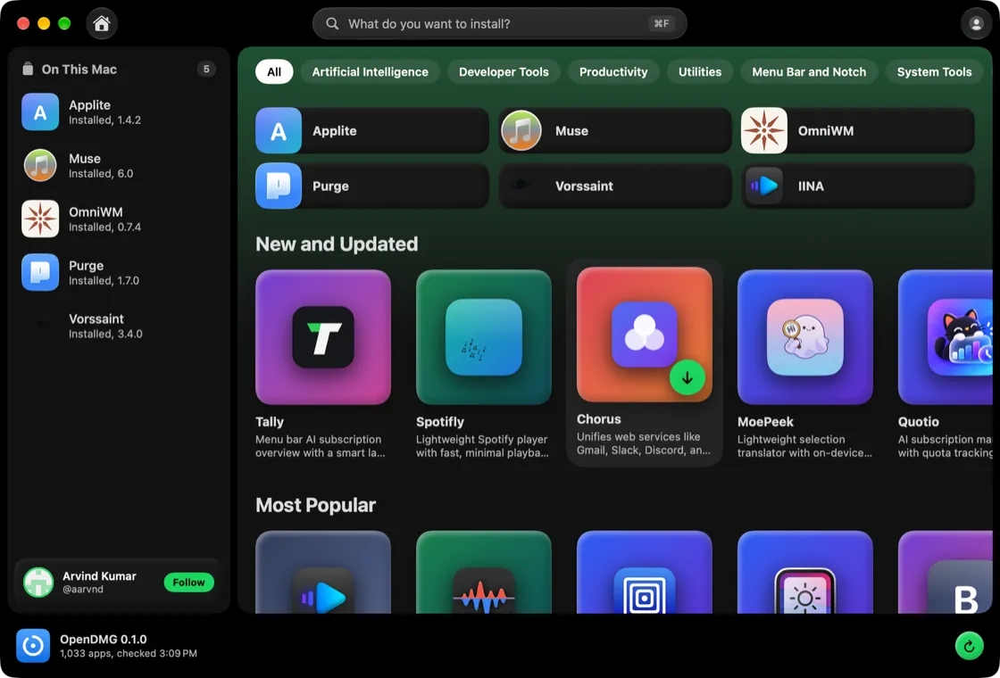

  <picture>
    <source media="(prefers-color-scheme: dark)" srcset="assets/hello-dark.svg">
    
  </picture>

  <a href="https://arvind.codes">arvind.codes</a> &nbsp;•&nbsp;
  <a href="https://clayshell.opendmg.app">Clayshell</a> &nbsp;•&nbsp;
  <a href="https://opendmg.app">OpenDMG</a> &nbsp;•&nbsp;
  <a href="mailto:hello@arvind.codes">hello@arvind.codes</a>

 

<h2 align="center">Things I've made</h2>

<table>
<tr>
<td width="46%"></td>
<td valign="middle">
<h3> &nbsp;Clayshell</h3>

An app for Mac and iPhone to look after your servers: a terminal, files, monitoring and alerts in one place. It asks for no account and collects nothing.

<a href="https://apps.apple.com/app/clayshell/id6819172609"><b>App Store →</b></a> &nbsp;&nbsp;&nbsp; <a href="https://clayshell.opendmg.app">Website</a> &nbsp;&nbsp;&nbsp; <a href="https://github.com/aarvnd/Clayshell">GitHub</a>

</td>
</tr>
<tr>
<td valign="middle">
<h3> &nbsp;OpenDMG</h3>

A free store for open source Mac apps. Browse more than 1,000 apps and install one with a click.

Out now for the Mac.

<a href="https://opendmg.app"><b>See it →</b></a> &nbsp;&nbsp;&nbsp; <a href="https://github.com/aarvnd/OpenDMG">GitHub</a>

</td>
<td width="46%"></td>
</tr>
</table>

 

<h2 align="center">A little about me</h2>

I like making things and finishing them. 
I'm still learning, mostly Swift for apps and a bit of the web. 
My site is <a href="https://arvind.codes">arvind.codes</a>.

 

Say hello: <a href="mailto:hello@arvind.codes">hello@arvind.codes</a>

